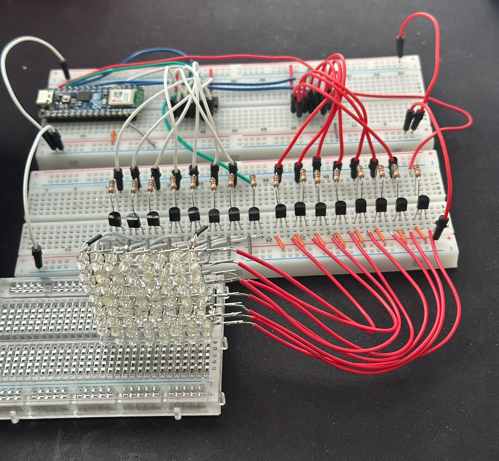

**Title:** Scrolling LED Matrix Display

**Project Description:**
This Arduino project utilizes a pair of 74HC595 shift registers to create a scrolling message display using an LED matrix. The displayed message can be easily modified and the scrolling speed can be adjusted.

**Hardware Components:**

* Arduino board (specify the type you're using)
* Two 74HC595 shift registers
* LED matrix (specify size and whether it's common anode or common cathode)
* Resistors (calculate appropriate values based on your LED matrix)
* Jumper wires
* Breadboard (optional)

**Software:**

* Arduino IDE

**Connections (provide a simple diagram if possible):**

* **74HC595 (1):**
  * Latch Pin -> Arduino Pin 2 
  * Clock Pin -> Arduino Pin 11
  * Data Pin -> Arduino Pin 10
* **74HC595 (2):**
  * Latch Pin -> Arduino Pin 3 
  * Clock Pin -> Arduino Pin 12
  * Data Pin -> Arduino Pin 9
* **LED Matrix:**
   * Column Pins -> Output pins of 74HC595 (1)
   * Row Pins -> Output pins of 74HC595 (2)
   * **Important:** Connect appropriate resistors for your LED matrix.

**Code Explanation:**

* **Pin Definitions:** Defines pin numbers for the shift registers.
* **Scroll Message:** Contains the message to be displayed (modify this!).
* **Scroll Speed:**  Controls scrolling speed (adjust as desired).
* **Font Definitions:** Provides a lookup table for character display on the LED matrix.
* **Setup():** Initializes pin modes.
* **Loop():** Calls the `scrollMessage()` function to display the message.
* **scrollMessage(const char *msg):** Handles the scrolling of the message across the display.
* **displayChar(char c, int offset):** Displays a single character on the LED matrix.

**Customization:**

* Change the message in the `msg` variable.
* Adjust `scrollSpeed` for desired scrolling effect.
* Modify the font definitions to add more characters.

**Get Started:**

1. Assemble the circuit according to the connections diagram.
2. Copy and paste the code into the Arduino IDE.
3. Customize the message and scroll speed if needed.
4. Upload the code to your Arduino board.

**Let me know if you'd like any specific sections explained in more detail or want help customizing the project further!** 

